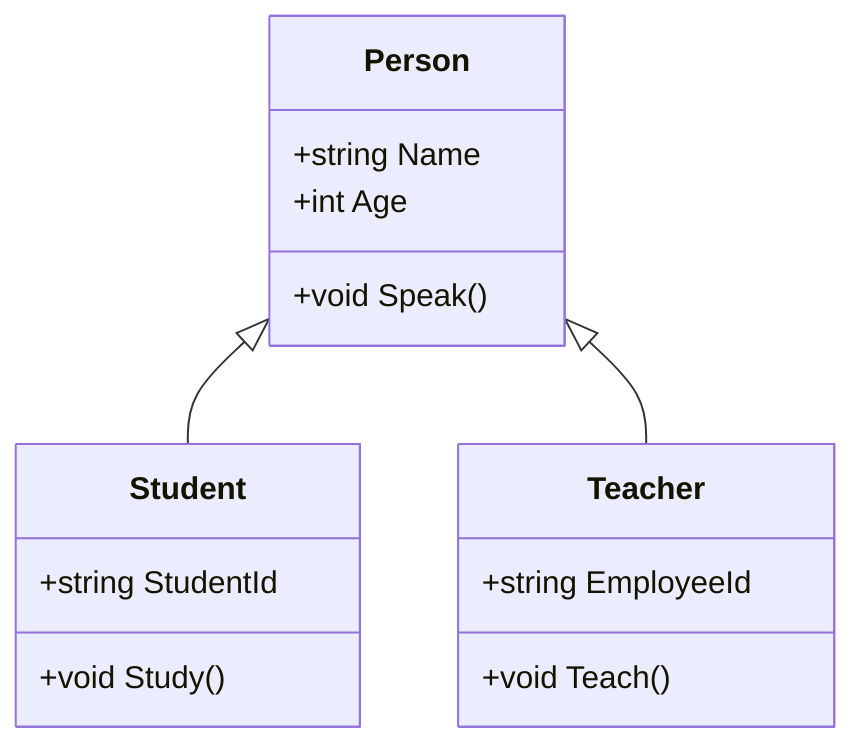
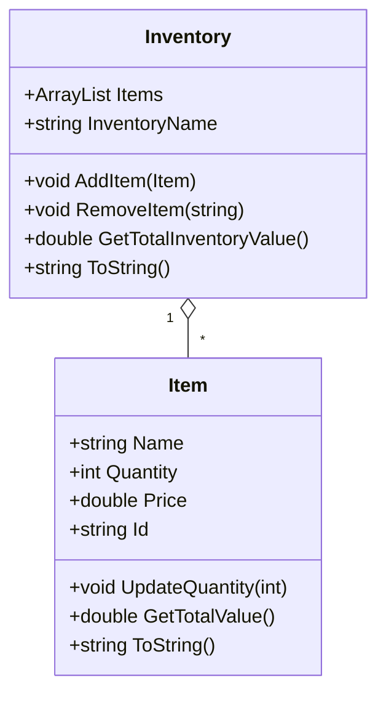

# PSClass-m
refresher for classes and modules in PowerShell

This project is for my refresher on Advance classes and Modules development in PS

Re-usabilty

lets sketch classes for the requirement

## Sample UML Diagram

## Inventory Module UML Diagram

